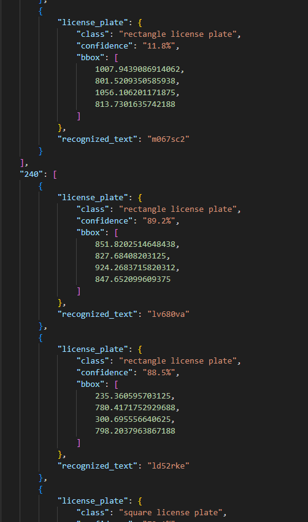

original source from https://github.com/chequanghuy/Character-Time-series-Matching

# git clone 
```python
!git clone https://github.com/HonorJay/Detecting_License_Plate.git
```

# change directory
```python
!cd /Detecting_License_Plate/Vietnamese/
```

# to Detect license plate and characters from video.
```python
!python DETECTION.py --lp_weights object.pt --ch_weights char.pt --source test_video.mp4 --device cuda:0
```

# result.json
<div align=center>

</div>

```json
"FrameNo": [
        {
            "license_plate": {
                "class": "rectangle license plate",
                "confidence": "89.2%",
                "bbox": [
                    851.8202514648438,
                    827.68408203125,
                    924.2683715820312,
                    847.652099609375
                ]
            },
            "recognized_text": "lv680va"
```
